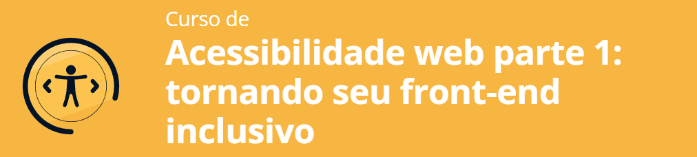
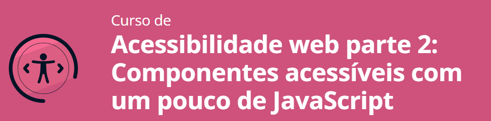

# Formação Acessibilidade Web

  

Este repositório é destinado ao projeto que desenvolvi com base nas aulas da Formação em Acessibilidade Web da Alura, composta por 3(três) cursos. 

## Curso 1:

    

O conteúdo deste curso é voltado exclusivamente para o desenvolvimento de interfaces acessíveis com foco em layout web, e tem como objetivo principal de fazer o design de um site que seja mais inclusivo.

**Neste curso, cinco abordagens tiveram foco:**

- O autismo;
- Surdez;
- Dislexia;
- Baixa visão;
- Deficiência física.

Além disso, a importância da implementação da acessibilidade se dá em virtude de que se trata de um nicho do mercado que infelizmente não é explorado pelos grandes portais, ainda que 25% da população brasileira possua algum tipo de deficiência. Ademais, é necessário que haja a conscientização de que, em algum momento, todas as pessoas possuirão alguma limitação, sendo assim, é necessário que tenhamos <b>empatia</b> como uma ótima ferramenta no desenvolvimento de qualquer atividade.

Outro ponto interessante abordado pelo curso foram as Diretrizes de Acessibilidade para Conteúdo Web (WCAG) disponíveis no site <a href="https://www.w3.org/Translations/WCAG20-pt-br/">W3</a>.

**Aprendizado do curso:**

- Melhoria na leitura do conteúdo textual, ao limitar cores gritantes e extremamente iluminadas;
- Diminuição do recurso de centralização dos textos, a fim de melhorar a leiturabilidade e legibilidade;
- Aumento do tamanho das bolinhas das opções do carrosel, importante, visto que requisita menos destreza manual do usuário;
- Redução de grandes blocos de textos e da quantidades de textos no decorrer na web page, dando maior destaque às imagens;
- Reposicionamos o botão "Receber emails", aproximando-o com o texto "Receber destaque por email", pensando na doutrina da Gestalt, em que a parte é entendida como o todo;
- Disponibilização de outras formas de contato além do telefone;
- Inclusão de uma mensagem de erro, além da notificação do erro por cores, a fim de maior apoio visual;
- Redução de pop-ups ou alertas ninjas que aparecem e somem na tela sem o controle do usuário, pois uma pessoa com deficiência física pode ter dificuldades de leitura e necessitar de habilidades motoras específicas;
- Não bloqueio do zoom em sites para usuários de dispositivos móveis;
- Remoção de sublinhados e textos inteiros em caixa alta;
- Inserção de legendas ou audiodescrições em vídeos; e
- Limitação de figuras de linguagem. 

## Curso 2:

    

O conteúdo deste curso é voltado exclusivamente para o desenvolvimento de interfaces acessíveis com foco em layout web, com foco em como, basicamente, as pessoas com deficiência visual utilizam o computador e a internet, e de que forma é possível deixarmos o site melhor, mais inclusivo e acessível, através das técnicas de front-end.

 Utilizamos uma ferramenta para vivenciarmos a rotina das pessoas com deficiência, o chamado leitor de tela. Especificamente neste curso, foi utilizado o <a href="https://www.nvaccess.org/download/">NVDA</a>.

**Aprendizado do curso:**

- Redução dos < h1 > em seções independentes, posto que alguns leitores podem se perder mesmo com a utilização de um leitor de tela;
- Maior cuidado com a marcação de conteúdo quando utilizamos elementos HTML5;
- Realização de testes e mais testes para tornar o projeto inclusivo e colocarmos em prática a empatia; 
- Cuidado com o sotaque. Para isso, devemos alterar o < html lang="en" > para pt-br e assim facilitar a compreensão do conteúdo para o usuário deficiente visual. Além disso, se precisamos que um fragmento de código seja lido em um idioma específico, teremos que inserir o atributo leng e acionar a opção atribuindo o idioma;
- No que diz respeito ao alt, aprendemos que toda imagem que possui valor informacional precisa ter um bom apoio textual. Precisamos ser bem descritivos, com acentuação correta e evitar generalismos;
- Colocar o elemento < title > em SVGs que forem inline (código direto no HTML);
- Declaração da "list-style:none" no CSS para que o leitor de tela não leia o ícone ao ler cada item de uma lista;
- Declaração do "display: none" e "visibility: hidden" para esconder visualmente elementos que o leitor de tela não precisa ler;
- Implementação do atributo "role", que serve para atribuir papéis aos elementos no nosso código, por exemplo, se queremos que uma < div > seja interpretada como um botão pelo leitor de tela, escreveremos role="button";
- Aplicação do pacote de expansão "WAI-ARIA" com a inserção do atributo "aria-labelledby", o qual significa "rotulado por";
- Atenção ao uso do "placeholder" como rótulo, pois o usuário, ao sair do campo depois de preencher algo, quando retornar, deverá ser lembrado do que se tratava esse campo, sendo assim, é importante que a < label > seja devidamente utilizada, sempre atrelando com os atributos "for" e "id";
- Inserção e facilitação do manuseio de legendas em vídeos; e
- Declaração do "readonly" em campos desabilitados.

## Curso 3: 

    

O conteúdo deste curso é totalmente focado em Front-end e JavaScript.

**Aprendizado do curso:**

- Como tornar os botões mais acessíveis passando as informações através da implementação do < span >;
- Plugin Emmet; 
- Alt vazio (ou alt="") para apontar uma informação irrelevante, sendo apenas ilustrativo;
- Melhorias de acessibilidade do modal; 
- Implementação do atributo Inert através de uma lib; 
- Retirando o foco inconveniente; 
- role="dialog" em janelas pop-up para o leitor de tela anunciar que foi aberta uma janela do tipo dialog/modal; 
- Fechar a modal/dialog ao apertar a tecla "Esc";
- Ajustes para que seja possível fechar a janela modal quando o usuário clicar em uma área externa a ela;
- Depois que o usuário clicar em algum botão, quando isto faz com que apareça uma janela ou haja outra interação, ele deve retornar ao ponto em que estava;
- Aplicação para que o botão que abre a janela seja exibido somente quando o JavaScript estiver habilitado com btnAbreDialog.style.display = 'block';
- A partir de role="dialog" na classe dialogNewsletter em index.html, quando se abre o modal, o NVDA lê "News sem spam", pois foi rotulado com o h2;
- No CSS, vimos que no content, o :after e o :before impactam diretamente no uso do leitor de telas, e por conta disto foi utilizado o aria-label;
- Melhorias na acessibilidade do carousel, que pode ter os componentes alterados apenas com CSS puro, mas isto às vezes pode comprometer a acessibilidade; 
- Melhorias no formulário de contato, em que foi validado o campo para CEP;
- Inclusão de mensagens de erro personalizadas e sugestões quando há erros de digitação; e
- No mesmo formulário, foi alterado o checkbox para que ele fosse identificado pelo leitor de telas.

## Tecnologias 

- [Figma](https://www.figma.com/)
- [NVDA](https://www.nvaccess.org/download/)
- [HTML5](https://html.com/)
- [CSS3](https://www.w3.org/Style/CSS/Overview.en.html)
- [JavaScript](https://www.javascript.com/)

## Resultados

<b>Resultado geral</b>

 <b>Resultado com NVDA</b>

## Status do projeto

**Concluído.**